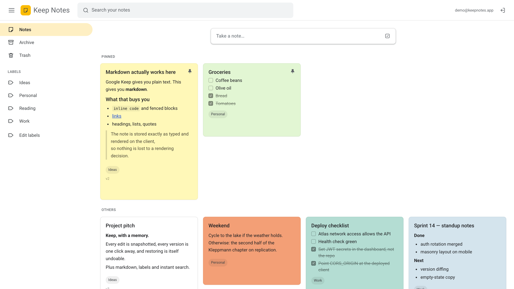
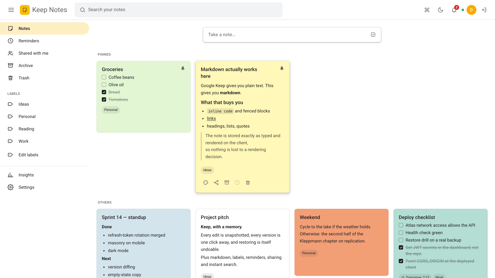
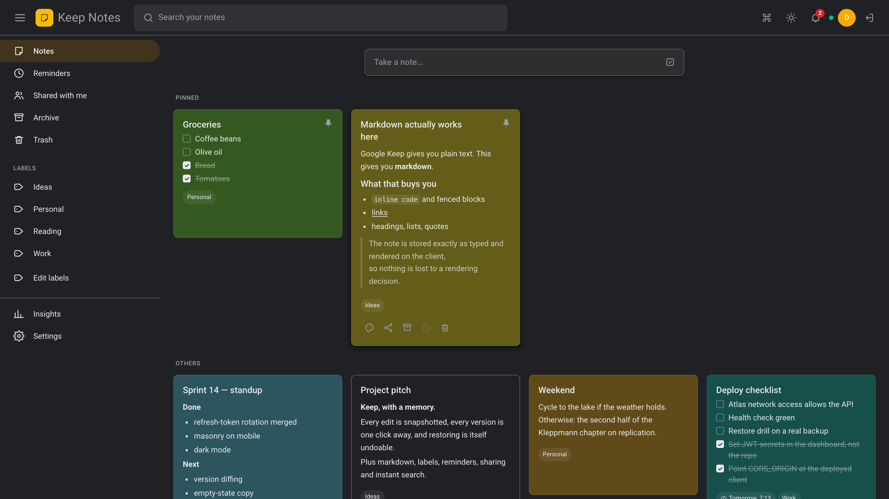
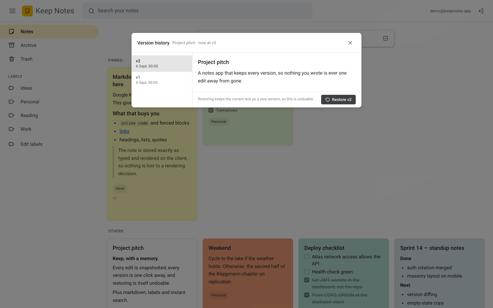
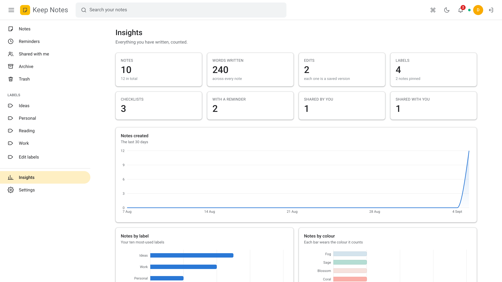
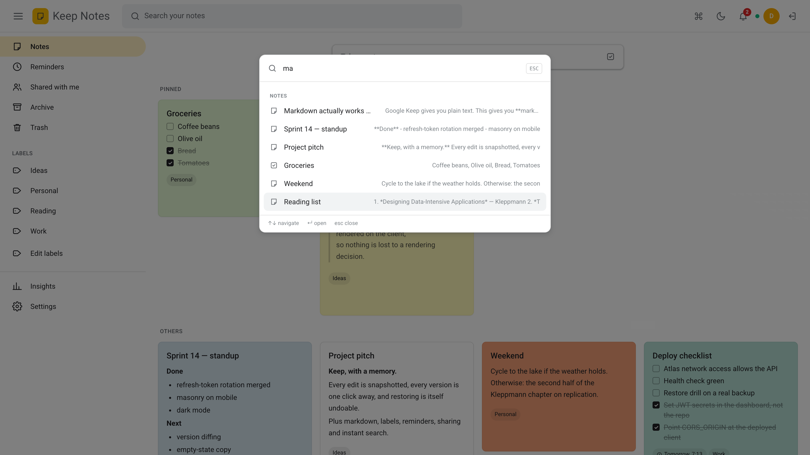
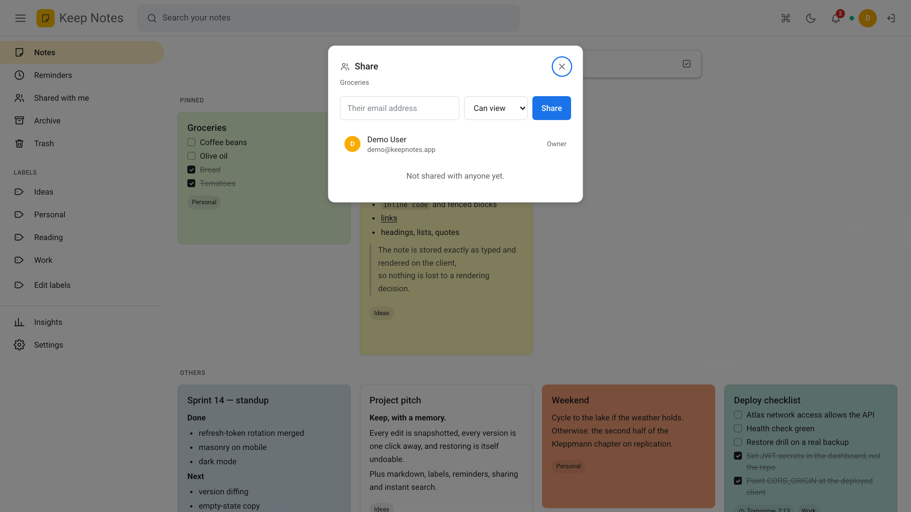

# Keep Notes — a collaborative MERN notes app

A Google Keep-style notes app built on the MERN stack (MongoDB, Express, React,
Node.js) — with the things Keep does not give you, and a few it does not have at
all.

| | Google Keep | This app |
|---|---|---|
| Accounts | Google account | Own JWT auth, rotating refresh tokens, **TOTP two-factor** |
| Note formatting | plain text | **Markdown**, rendered and sanitised |
| Organising | labels | labels, tag-filtered views, drag-to-reorder |
| History | none | **every version, restorable, with a word-level diff** |
| Collaboration | share a note | **viewer/editor roles, live sync, presence, conflict detection** |
| Insight | none | **a dashboard of what you have written** |

Everything Keep-shaped is here too: notes and checklists, eleven note colours in
both light and dark, pin, archive, a soft-delete trash that empties itself after
30 days, reminders, image attachments, a masonry board, and search that filters
as you type.

<p align="center">
  
</p>

---

## Run it

Node 20+. A database is optional — see below.

```bash
git clone https://github.com/muttaqi123/notes-app.git
cd notes-app
npm run install:all
npm run dev
```

The API is on `http://localhost:4000` (docs at `/api/docs`), the client on
`http://localhost:5173`.

**About the database.** With `MONGODB_URI` unset the server starts an in-memory
MongoDB on boot, so the app runs on a clean machine with nothing installed. It
is real MongoDB — real indexes, real validation — but it is wiped when the
process stops. For a database that persists:

```bash
docker compose up -d mongo
cp server/.env.example server/.env   # MONGODB_URI already points at it
npm run seed
```

The seed creates **two** accounts, because half the app is about collaboration
and one account cannot demonstrate a shared note:

| | |
|---|---|
| `demo@keepnotes.app` | `demo-password-123` |
| `sara@keepnotes.app` | `demo-password-123` — the collaborator |

Sign in as each in two different browsers and watch an edit in one appear in the
other.

To run the whole stack in Docker instead: `docker compose up --build`, then
open `http://localhost:8080`.

## Test it

```bash
npm test          # 95 API tests + 24 client tests
npm run test:e2e  # Playwright, against a real browser
npm run lint
```

- **95 API tests** — auth, two-factor, CRUD, ownership, sharing and roles,
  optimistic concurrency, pagination, reminders, the trash purge, the activity
  log, export and stats. They run against an in-memory MongoDB, so there is no
  database to install and no fixtures to load.
- **24 client tests** — the markdown sanitiser and the board's state machine:
  instant search, optimistic updates and their rollback, live-update merging.
- **Playwright** — sign-up, writing a note, search, the trash round trip,
  version restore, sharing between two browser contexts, the command palette
  and the theme toggle.

Every push runs all of it in GitHub Actions.

---

## How it is put together

```
notes-app/
├── server/                     Express + Mongoose + Socket.IO
│   └── src/
│       ├── app.js              builds the Express app (no listener, no DB)
│       ├── index.js            connects the DB, attaches sockets, listens
│       ├── config/             env parsing, DB connection
│       ├── models/             User, Note, NoteVersion, Label,
│       │                       NoteShare, Activity, Notification
│       ├── services/           ALL BUSINESS LOGIC — no Express in here
│       │   ├── permissions.js  the single answer to "may they?"
│       │   └── events.js       the bus the real-time layer listens on
│       ├── realtime/           the ONLY file that knows WebSockets exist
│       ├── jobs/               reminder sweep, nightly trash purge
│       ├── controllers/        read the request, call a service, respond
│       ├── routes/             paths, auth, zod schemas
│       ├── docs/openapi.js     the API reference, from the same schemas
│       └── middleware/         auth, validation, the one error handler
└── client/                     React 18 + Vite + Tailwind
    └── src/
        ├── api/client.js       fetch wrapper, token refresh, one retry
        ├── context/            auth, theme, toasts
        ├── hooks/              useNotes, useSocket, useHotkeys, …
        ├── components/         Shell, NoteCard, NoteEditor, CommandPalette, …
        └── pages/              Auth, Notes, Insights, Settings
```

### The one rule the layout enforces

**Business logic lives in `server/src/services/` and imports nothing from
Express.** A service takes plain values and returns plain values. It never sees
a `Request`, never sets a status code, never builds a response.

Real-time sync did not break that rule, which is the best evidence it is worth
keeping. A service says *"this note changed, and these people can see it"* on an
in-process event bus; `realtime/index.js` — the only file in the server that
knows WebSockets exist — subscribes and forwards. No service imports it, so the
whole feature could be deleted without touching a line of business logic. **All
36 original tests passed untouched through the rewrite that added sharing,
reminders and attachments.**

### Permissions, in one place

Three levels, each strictly containing the next:

| | who | may |
|---|---|---|
| `read` | owner, editors, viewers | see the note and its history |
| `write` | owner, editors | edit the content |
| `own` | owner only | share, delete, change collaborators |

Every note operation goes through `authorize()`, so there is exactly one answer
to "can this person do this" rather than a check repeated — and eventually
forgotten — in each service function. **Every refusal is a 404, not a 403**,
including a viewer trying to edit: a 403 confirms the note exists.

### Version history, and what happens when two people save at once

Every note carries a `version`. On an edit that changes **content**, the server
snapshots the state *before* the edit and increments the number.

- **A separate collection, not an array on the note.** Versions are written on
  every edit and read almost never; an array would make every note document grow
  without limit, and that document is the hot path.
- **Content only.** Pinning, archiving or recolouring does not create a version.
  A history full of "you pinned this" is a history nobody reads.
- **Restoring is itself versioned**, so going back is never how you lose the
  newer draft.
- **The client saves on close**, not per keystroke — one editing session is one
  version, which is a history a person can actually read.

A `PATCH` carries `expectedVersion`. If someone else saved in the meantime the
server answers **409 with the note as it currently stands**, and the editor shows
both versions side by side. Last-write-wins is the version of this feature where
somebody quietly loses a paragraph.

### Security

- Passwords are bcrypt at cost 12. The hash never leaves the server.
- The **access token** is a 15-minute JWT in a JavaScript variable, not
  `localStorage` — which any script on the page can read, so a token there turns
  one XSS bug into a stolen session.
- The **refresh token** is a random opaque string in an `httpOnly` cookie, stored
  server-side only as a SHA-256 hash, **rotated on every use**. A stolen one is
  good for a single use, and the theft surfaces as the real user being signed out.
- **Two-factor (TOTP)** with single-use recovery codes. Setup and confirmation
  are separate steps on purpose: scanning the QR code enables nothing, so losing
  the phone mid-enrolment cannot lock you out of your own account.
- **Attachments are decoded and re-encoded** through sharp before anything
  touches disk, so what lands there is provably an image and carries no EXIF, and
  the stored name is a UUID rather than anything the uploader chose.
- Rendered markdown goes through DOMPurify, with a URI allow-list so a
  `javascript:` link is not a link.
- zod validates every request body at the edge; unknown keys are stripped.
- Sign-in and password reset are rate limited; the reset endpoint answers
  identically whether or not the address is registered.
- `config/env.js` **refuses to start in production without real secrets** rather
  than falling back to a development default.

---

## API

`/api/docs` serves an OpenAPI reference generated from the same zod schemas the
routes validate with — so the documentation cannot describe a shape the server
would reject.

| Method | Path | |
|---|---|---|
| `POST` | `/api/auth/register` · `/login` · `/refresh` · `/logout` | accounts and sessions |
| `POST` | `/api/auth/2fa/setup` · `/confirm` · `/disable` | two-factor |
| `POST` | `/api/auth/forgot-password` · `/reset-password` | password reset |
| `GET` | `/api/auth/sessions` | signed-in devices, individually revocable |
| `GET` | `/api/notes` | `?view=active\|archive\|trash\|shared\|reminders&label=&q=&sort=&cursor=` |
| `POST/PATCH/DELETE` | `/api/notes[/:id]` | CRUD; PATCH takes `expectedVersion` |
| `PATCH` | `/api/notes/reorder` | manual ordering, one request for the board |
| `GET/POST` | `/api/notes/:id/versions[/:v/restore]` | history and rollback |
| `GET` | `/api/notes/:id/activity` | who changed what |
| `GET/POST/PATCH/DELETE` | `/api/notes/:id/collaborators[/:userId]` | sharing and roles |
| `POST/DELETE` | `/api/notes/:id/attachments[/:attachmentId]` | images |
| `GET` | `/api/notes/stats` | counts, 30-day timeline, breakdowns |
| `GET` | `/api/export/json` · `/markdown` | take your notes with you |

WebSocket events: `note:changed`, `note:removed`, `notification:new`,
`activity:new`, `presence:state`, `note:typing`.

---

## Deploying

| Piece | Where | Notes |
|---|---|---|
| Database | MongoDB Atlas | Free tier; add the API's egress to Network Access |
| API | Render, Fly, Railway | Root `server`, build `npm ci`, start `npm start`, health check `/api/health` |
| Client | Vercel, Netlify | Root `client`, build `npm run build`, output `dist`, `VITE_API_URL` set |

Set in the API host's dashboard:

```
MONGODB_URI        the Atlas SRV string
JWT_ACCESS_SECRET  node -e "console.log(require('crypto').randomBytes(48).toString('hex'))"
JWT_REFRESH_SECRET the same again, a different value
CORS_ORIGIN        the deployed client origin
NODE_ENV           production
```

Two things worth knowing:

- **`vercel.json` rewrites every path to `index.html`.** Without it, refreshing
  on `/archive` is a 404 from the CDN — it looks for a file, and the router never
  gets a chance to run.
- **`render.yaml` only applies to a service created *from* a Blueprint.** A
  service created by hand in the dashboard ignores it. That is why the secret
  check lives in `config/env.js`: a security default has to be safe in code, so
  that forgetting the deployment file is harmless.

Attachments are written to disk, so a host with an ephemeral filesystem needs a
mounted volume — or S3, which is a change to one service file.

---

## Stack, and why

| Layer | Choice | Why this one |
|---|---|---|
| Runtime | Node 20, ES modules | `import` throughout, no build step on the server |
| API | Express 4 | Small and explicit; the routing is the whole framework |
| DB | MongoDB + Mongoose 8 | A note *is* one document — title, body, an array of items, references to labels — and it is always read whole |
| Real-time | Socket.IO | Falls back to polling where a WebSocket upgrade will not pass |
| Auth | JWT + rotating refresh tokens + TOTP | Stateless requests, and revocation that actually revokes |
| Validation | zod | One schema per route, at the edge, and the OpenAPI spec for free |
| Jobs | node-cron | Two jobs; a queue would be infrastructure with nothing in it |
| Images | sharp | Re-encoding is the security boundary, not a nicety |
| UI | React 18 + Vite | Fast dev server, explicit API boundary |
| Styling | Tailwind 3 + CSS custom properties | Utilities for layout, properties for the theme |
| Charts | Recharts | Lazily loaded — a third of the bundle for one screen |
| Tests | Jest, supertest, mongodb-memory-server, Vitest, RTL, Playwright | Real Mongo semantics with no database to install |

Deliberately **not** used: Redis (nothing to cache; refresh tokens are one query
away), Redux (one screen owns the note state), and an ORM-free driver (the
schema, indexes and `populate` would all be hand-rolled).

---

## Screens

| | |
|---|---|
|  |  |
| The board — masonry, pinned first, colours, labels | The same board in dark |
|  |  |
| Version history with a word-level diff | What you have written, counted |
|  |  |
| ⌘K — notes, views and commands | Sharing, with roles |

---

Built by **Muhammad Muttaqi**.
